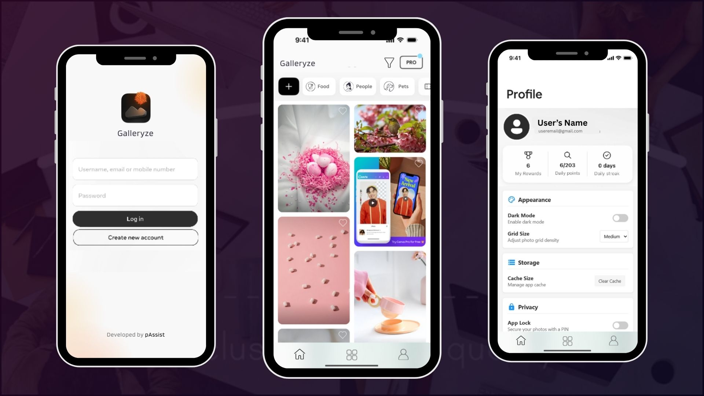

# Galleryze

A gallery App for android/IOS with ML Kit image classification

## Getting Started

This project is a starting point for a Flutter application.

A few resources to get you started if this is your first Flutter project:

- [Lab: Write your first Flutter app](https://docs.flutter.dev/get-started/codelab)
- [Cookbook: Useful Flutter samples](https://docs.flutter.dev/cookbook)

For help getting started with Flutter development, view the
[online documentation](https://docs.flutter.dev/), which offers tutorials,
samples, guidance on mobile development, and a full API reference.

## About the app
Features (based on the codebase structure):

Photo Gallery Management
Custom Categories for Photos
Grid View Layout
Image Caching
Cross-platform Support (Web, Mobile, Desktop)
Backend Database Integration (Supabase)
Material Design Theme
State Management using Provider
ML Kit Image Classification - Automatically categorizes images into Documents, People, Animals, Nature, Food, and Others
The project is set up to run on port 5000 for web development 

## ML Kit Image Classification

The app uses Google's ML Kit Image Labeling to automatically classify images into categories:

1. **Documents** - Detects documents, screenshots, receipts, etc.
2. **People** - Identifies people in photos
3. **Animals** - Recognizes various animals
4. **Nature** - Detects nature scenes like mountains, lakes, etc.
5. **Food** - Identifies food and beverages
6. **Others** - Fallback category for unclassified images

### Using the Image Classification Feature

1. The app will automatically scan and classify images from:
   - **Android**: The main Pictures folder on your device (`/storage/emulated/0/Pictures/`)
   - **iOS**: The app's Documents folder

2. To use this feature:
   - Make sure you have some images in your device's Pictures folder
   - Click the auto-classify button (⚡) in the app header
   - Grant the necessary storage permissions when prompted
   - The app will analyze all images and organize them into the appropriate categories

3. For best results:
   - Use clear, well-lit photos
   - Make sure your device has enough storage space for ML processing
   - Allow the classification process to finish completely 